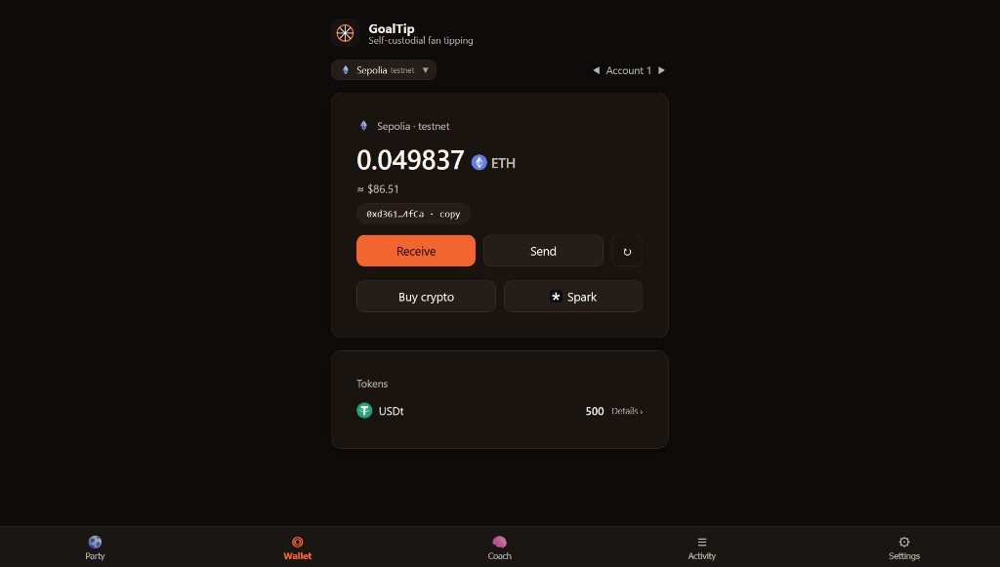
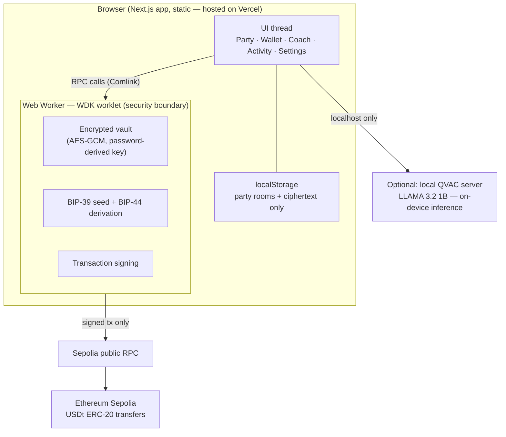

<div align="center">


# GoalTip

**Self-custodial USDT tipping for football watch parties.**
Fans back a nation, tip live in USDt, and watch the pool grow — while their keys never leave the browser.

[**Live demo**](https://goaltip-web.vercel.app) · [Demo video](./SUBMISSION.md) · [Architecture](#architecture) · [Quick start](#quick-start)

Built with [Tether WDK](https://wdk.tether.io) for the [Tether Developers Cup](https://dorahacks.io/hackathon/tether-developers-cup) — **WDK : Wallets** track, with an optional [QVAC](https://qvac.tether.io) local-AI coach.



</div>

---

## Why GoalTip

Every match night, fans in group chats say *"loser buys drinks"* — and then nobody settles up. GoalTip makes that moment real:

- **Create a watch party** for tonight's match (any two nations)
- **Tip your nation** in USDt — 1, 5, 10, or any amount
- **Watch the pool** update live, with every tip verifiable on-chain
- **Stay self-custodial** — GoalTip never touches your keys. Ever.

No signup, no server-side accounts, no custodian. Your wallet is generated in your browser, encrypted with your password, and signs everything locally.

## Highlights

| | |
|---|---|
| ⚽ **Football-native** | Nation-vs-nation tipping pools built around the watch-party moment |
| 🔐 **True self-custody** | BIP-39/BIP-44 wallet lives in a Web Worker; private keys never reach the DOM, the network, or any server |
| 💸 **Real on-chain USDt** | ERC-20 transfers on Sepolia testnet — every tip links to Etherscan |
| 🧠 **Local AI coach** | Optional QVAC-powered match analyst running 100% on-device (LLAMA 3.2 1B), no cloud, no API keys |
| 📱 **Installable PWA** | Works on mobile, installs to the home screen, dark theme |
| 🌍 **Portable keys** | Standard recovery phrase — restore the same wallet in any BIP-44 wallet app |

## Quick start

Requirements: **Node 20+**, **pnpm 10**

```bash
git clone https://github.com/thesithunyein/goaltip.git
cd goaltip
pnpm install
pnpm dev
```

Open `http://localhost:3000` — create a wallet, open the **Party** tab, and start tipping.

Or skip setup entirely: **https://goaltip-web.vercel.app**

## Try the full flow in 3 minutes

1. **Create a wallet** — recovery phrase is generated inside a Web Worker, verified, then encrypted with your password
2. **Start a watch party** — pick two nations (e.g. Myanmar 🇲🇲 vs Brazil 🇧🇷); a room code and tipping pool are created
3. **Fund your wallet** (free testnet tokens, ~1 minute):
   - Gas: [Alchemy Sepolia ETH faucet](https://www.alchemy.com/faucets/ethereum-sepolia)
   - USDt: [Aave faucet](https://app.aave.com/faucet/) — enable **Testnet Mode** (gear icon), pick the Sepolia market, mint USDT
4. **Tip your nation** — 1 / 5 / 10 USDt presets or a custom amount
5. **Verify on-chain** — every tip shows an `explorer ↗` link to [Sepolia Etherscan](https://sepolia.etherscan.io)
6. **Optional:** run the local QVAC coach (below) and ask for a match read — all inference on your machine

The test USDt contract is [`0xaA8E…33D0`](https://sepolia.etherscan.io/address/0xaA8E23Fb1079EA71e0a56F48a2aA51851D8433D0) (6 decimals, mintable via the Aave faucet).

## Architecture

The security boundary is the Web Worker. The UI thread renders screens and requests actions; the worker owns the seed, derives keys, and signs. Nothing sensitive crosses back.



Key properties:

- **Keys never leave the worker.** The UI receives addresses and signed transactions — never the seed or private keys.
- **The server holds nothing.** Vercel serves static assets; there is no backend, no database, no session. Wiping localStorage + your password = only you can restore, via your recovery phrase.
- **Tips are plain ERC-20 transfers** to the party pool address, encoded client-side (`transfer(address,uint256)`) and signed in the worker.
- **The AI coach is local-first.** The QVAC SDK runs the model on your device; the web app talks to `localhost` only. No cloud AI, no API keys, no data leaves the machine.

More depth: [docs/ARCHITECTURE.md](./docs/ARCHITECTURE.md) · [docs/INTEGRATION.md](./docs/INTEGRATION.md)

## Project structure

```
goaltip/
├── apps/web/                  # Next.js app (deployed to Vercel)
│   └── src/
│       ├── components/        # Watch party, coach, wallet UI
│       ├── wallet/            # Chain catalog, tokens, ERC-20 encoding, worker client
│       └── app/               # App router, PWA manifest, layout
├── packages/
│   ├── wdk-web-core/          # WDK worklet: vault, derivation, signing, RPC
│   └── wdk-ui/                # Reusable wallet UI kit (themes, brand, components)
├── coach/server.mjs           # Optional local QVAC inference server
└── docs/                      # Architecture, setup, integration notes
```

## Optional: local AI coach (QVAC)

The Coach tab talks to a small local server that runs LLAMA 3.2 1B **on your device** through the QVAC SDK — no cloud, no API keys.

```bash
npx @qvac/sdk doctor     # check your machine can run local inference
pnpm add @qvac/sdk       # optional dependency, not required for the wallet
npm run coach            # starts the local inference server
pnpm dev                 # coach tab now shows "online"
```

Model: `LLAMA_3_2_1B_INST_Q4_0`. The deployed site correctly reports the coach as offline — by design, it only ever connects to `localhost`.

## Testing & CI

```bash
pnpm -F @wdk-starter/web typecheck   # strict TypeScript
pnpm -F @wdk-starter/web test        # vitest — chain catalog, ERC-20 encoding, amount parsing, bridge
pnpm build                           # full production build
```

GitHub Actions runs build + tests on every push.

## Deploy your own

1. Fork and import the repo in [Vercel](https://vercel.com)
2. Set **Root Directory** to `apps/web`
3. Deploy — `apps/web/vercel.json` carries the build/install commands

## External services & credits

- **Tether WDK** — wallet worklet: custody, derivation, signing
- **Tether QVAC SDK** (optional) — local AI inference
- **Sepolia public RPC** — chain access (no key material ever sent)
- **Aave v3 Sepolia test USDT** — mintable demo token
- **Vercel** — static hosting only
- Built on the open-source `wdk-wallet-template`; all GoalTip features (watch party, tipping pools, nations, coach, branding) were built during the event

## Roadmap

- **Group pools with claim logic** — winner-nation fans split the pool via a smart contract
- **P2P party sync** — replace localStorage rooms with Hyperswarm (Pears stack) so friends see one live pool
- **Match data feeds** — auto-create parties from real fixtures
- **Mainnet USDt on Plasma** — one config flip away (`DEFAULT_CHAIN_ID`)

## License

MIT — see [LICENSE](./LICENSE).

---

<div align="center">
<sub>⚽ Built in Myanmar 🇲🇲 for the Tether Developers Cup 2026</sub>
</div>
