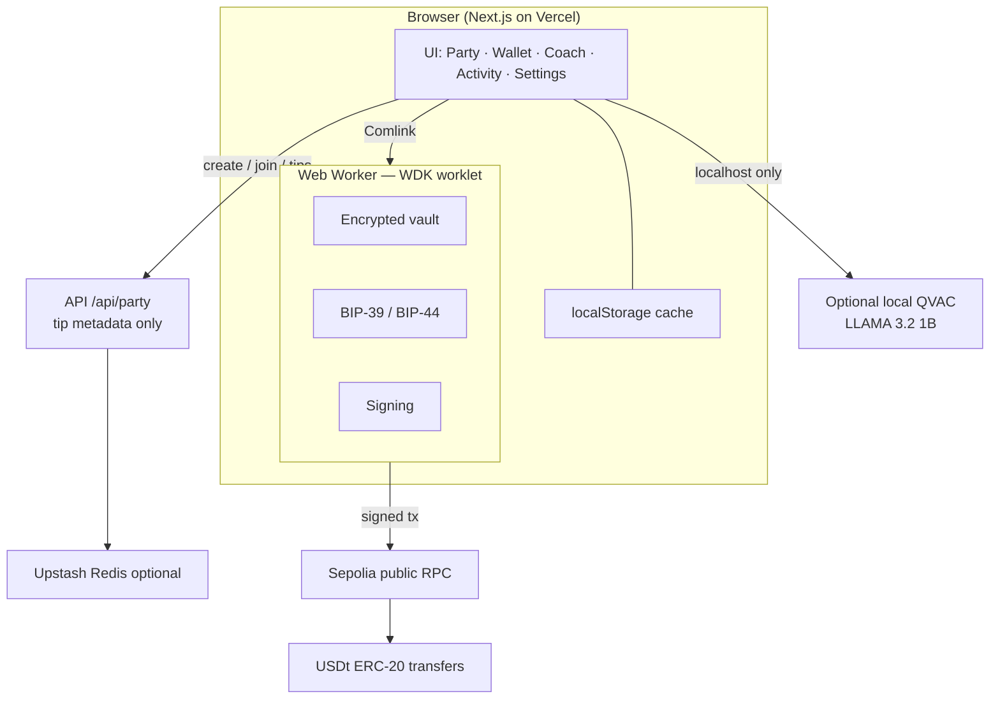

<div align="center">


# GoalTip

**Self-custodial USDT tipping for football watch parties.**
Fans back a nation, tip live in USDt, and watch a **shared** pool grow — while their keys never leave the browser.

[**Live demo**](https://goaltip-web.vercel.app) · [**Demo video**](https://youtu.be/2p8f8a_Tj0w) · [Architecture](#architecture) · [Quick start](#quick-start)

Built with [Tether WDK](https://wdk.tether.io) for the [Tether Developers Cup](https://dorahacks.io/hackathon/tether-developers-cup) — **WDK : Wallets** track, with an optional [QVAC](https://qvac.tether.io) local-AI coach.


</div>

---

## Why GoalTip

Every match night, fans in group chats say *"loser buys drinks"* — and then nobody settles up. GoalTip makes that moment real:

- **Create a shared watch party** for tonight's match (any two nations)
- **Invite friends** with a room code or link — every device sees the same tip board
- **Tip your nation** in USDt — 1, 5, 10, or any amount — signed locally with WDK
- **Verify on-chain** — every tip links to Sepolia Etherscan
- **Stay self-custodial** — GoalTip never touches your keys. Ever.

No signup, no custodian. Your wallet is generated in your browser, encrypted with your password, and signs everything locally. The shared board only stores tip *metadata* (nation, amount, tx hash) — never keys.

## Highlights

| | |
|---|---|
| Football-native | Nation-vs-nation tipping pools built around the watch-party moment |
| True self-custody | BIP-39/BIP-44 wallet lives in a Web Worker; private keys never reach the DOM or any server |
| Shared rooms | Create / join by code; invite link `?room=CODE`; live tip board sync across devices |
| Real on-chain USDt | ERC-20 transfers on Sepolia — every tip links to Etherscan |
| Local AI coach | Optional QVAC-powered match analyst (LLAMA 3.2 1B), on-device, no cloud |
| Installable PWA | Works on mobile, installs to the home screen |

## Quick start

Requirements: **Node 20+**, **pnpm 10**

```bash
git clone https://github.com/thesithunyein/goaltip.git
cd goaltip
pnpm install
pnpm dev
```

Open `http://localhost:3000` — create a wallet, open the **Party** tab, create or join a room, and tip.

Or skip setup: **https://goaltip-web.vercel.app**

### Shared rooms on Vercel (recommended)

For multi-device demos that survive serverless cold starts, add free [Upstash Redis](https://upstash.com) credentials in the Vercel project (Root Directory `apps/web`):

```
UPSTASH_REDIS_REST_URL=...
UPSTASH_REDIS_REST_TOKEN=...
```

See [apps/web/.env.example](./apps/web/.env.example). Without Redis, rooms use in-memory storage (fine for local `pnpm dev`; on Vercel, prefer Upstash).

## Try the full flow in 3 minutes

1. **Create a wallet** — recovery phrase is generated inside a Web Worker
2. **Create a shared room** — pick nations (e.g. Myanmar vs Brazil), copy the invite link
3. **Join on a second device** — open the link or enter the room code
4. **Fund your wallet** (free testnet tokens):
   - Gas: [Alchemy Sepolia ETH faucet](https://www.alchemy.com/faucets/ethereum-sepolia)
   - USDt: [Aave faucet](https://app.aave.com/faucet/) — enable **Testnet Mode**, Sepolia market, mint USDT
5. **Tip from both devices** — boards update for everyone; open `explorer` links
6. **Optional:** run the local QVAC coach (below)

The test USDt contract is [`0xaA8E…33D0`](https://sepolia.etherscan.io/address/0xaA8E23Fb1079EA71e0a56F48a2aA51851D8433D0) (6 decimals).

## Architecture

The security boundary is the Web Worker. The UI requests actions; the worker owns the seed, derives keys, and signs. Shared rooms sync tip metadata only.



Key properties:

- **Keys never leave the worker.** The UI receives addresses and signed txs only.
- **Shared board is metadata-only.** Room code, nations, pool address, tip amounts + tx hashes. No private keys, no seed, no passwords.
- **Tips are ERC-20 transfers** to the party pool address, encoded client-side and signed in the worker.
- **QVAC is local-first.** The live site correctly shows the coach offline; run `npm run coach` on your machine for on-device answers.

## Project structure

```
goaltip/
├── apps/web/                          # Next.js app (Vercel)
│   ├── public/
│   │   ├── goaltip-mark.svg           # Favicon, PWA, in-app mark
│   │   └── sw.js                      # Service worker
│   ├── src/
│   │   ├── app/
│   │   │   ├── api/party/             # Shared room API
│   │   │   │   ├── route.ts           # POST create room
│   │   │   │   └── [code]/
│   │   │   │       ├── route.ts       # GET room
│   │   │   │       └── tips/route.ts  # POST tip metadata
│   │   │   ├── layout.tsx             # Metadata + icons
│   │   │   ├── manifest.ts            # PWA manifest
│   │   │   ├── page.tsx
│   │   │   └── providers.tsx
│   │   ├── components/
│   │   │   ├── watch-party-screen.tsx # Create / join / tip / invite
│   │   │   ├── coach-screen.tsx       # Optional QVAC coach UI
│   │   │   ├── wallet-shell.tsx       # Tabs: Party Wallet Coach…
│   │   │   ├── brand-header.tsx
│   │   │   ├── nation-flag.tsx        # Flag images (Windows-safe)
│   │   │   ├── dashboard.tsx
│   │   │   ├── onboarding-flow.tsx
│   │   │   └── …
│   │   ├── lib/
│   │   │   ├── nations.ts
│   │   │   ├── party-types.ts
│   │   │   ├── party-store.ts         # Client cache + API helpers
│   │   │   └── party-server.ts        # Upstash Redis / memory store
│   │   └── wallet/
│   │       ├── chains.ts              # Default: Sepolia
│   │       ├── tokens.ts              # Sepolia test USDt
│   │       ├── erc20.ts
│   │       ├── wallet-client.ts
│   │       ├── wallet-provider.tsx
│   │       └── worker.ts
│   ├── vercel.json
│   └── .env.example
├── packages/
│   ├── wdk-web-core/                  # WDK worklet: vault, derive, sign, RPC
│   │   └── src/
│   │       ├── worker/wallet-worker.ts
│   │       ├── chains/                # ethereum, sepolia, plasma, …
│   │       ├── vault/
│   │       └── adapters/
│   └── wdk-ui/                        # Theme, brand, wallet UI primitives
├── coach/
│   └── server.mjs                     # Optional local QVAC inference
├── docs/
│   ├── goaltip-mark.svg
│   ├── screenshot-wallet.png
│   ├── DEMO_SCRIPT.md
│   ├── ARCHITECTURE.md
│   └── …
├── .github/workflows/                 # CI
├── SUBMISSION.md                      # DoraHacks copy-paste
├── README.md
└── LICENSE                            # MIT
```

## Author

Built by [**thesithunyein**](https://github.com/thesithunyein) (Sithu Nyein) for the Tether Developers Cup 2026.

## Optional: local AI coach (QVAC)

```bash
npx @qvac/sdk doctor
pnpm add @qvac/sdk
npm run coach
pnpm dev
```

Model: `LLAMA_3_2_1B_INST_Q4_0`. Coach tab shows an Online/Offline badge and setup steps when offline.

## Testing & CI

```bash
pnpm -F @wdk-starter/web typecheck
pnpm -F @wdk-starter/web test
pnpm build
```

## Deploy your own

1. Import the repo in [Vercel](https://vercel.com)
2. Set **Root Directory** to `apps/web`
3. Add Upstash env vars (recommended)
4. Deploy (`apps/web/vercel.json` has install/build commands)

## External services

- **Tether WDK** — custody, derivation, signing
- **Tether QVAC SDK** (optional) — local AI
- **Sepolia public RPC** — broadcast (no key material)
- **Aave v3 Sepolia test USDT** — mintable demo token
- **Upstash Redis** (optional) — shared room persistence
- **Vercel** — hosting + API routes

Started from the open-source `wdk-wallet-template` (MIT). All GoalTip product work (watch parties, tipping, branding, coach, docs, demo) by [thesithunyein](https://github.com/thesithunyein).

## Roadmap

- **P2P party sync** via Hyperswarm (Pears) so rooms need no central store
- **Smart-contract pool** with winner-nation claim logic
- **Match data feeds** from real fixtures
- **Mainnet USDt on Plasma** — one `DEFAULT_CHAIN_ID` flip away

## License

MIT — see [LICENSE](./LICENSE).

---

<div align="center">
<sub>Built by <a href="https://github.com/thesithunyein">thesithunyein</a> in Myanmar for the Tether Developers Cup 2026</sub>
</div>
