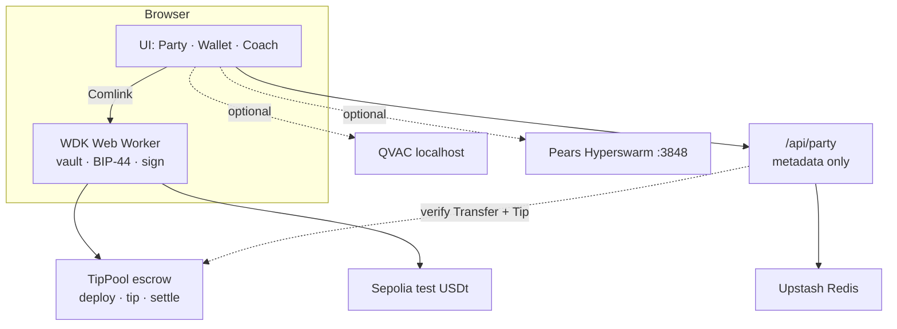

<div align="center">


# GoalTip

**Self-custodial USDt tipping for football watch parties.**  
Keys stay in a Web Worker. Tips go into an on-chain TipPool. The board only accepts what Sepolia proves.

[**Live**](https://goaltip-web.vercel.app) · [**Judge**](https://goaltip-web.vercel.app/judge) · [**Health**](https://goaltip-web.vercel.app/api/health) · [**Demo video**](https://youtu.be/u8otedpp1mI) · [**JUDGE.md**](./JUDGE.md)

**Tracks:** [WDK](https://wdk.tether.io) · [QVAC](https://qvac.tether.io) (local) · [Pears](https://docs.pears.com) (Hyperswarm, local)  
Built for the [Tether Developers Cup](https://dorahacks.io/hackathon/tether-developers-cup).

</div>

---

## Why GoalTip

Match night: someone says *loser buys drinks* — and nobody pays. GoalTip makes that moment real without a custodian.

1. **Create a room** → host deploys a TipPool escrow (deploy receipt verified)
2. **Invite friends** → same live tip board on every device
3. **Tip a nation** → `TipPool.tip(nationId, amount)` signed in the WDK Web Worker
4. **Board verifies** → Sepolia Transfer **and** Tip event (nation + amount)
5. **Host settles** → `TipPool.settle` on-chain; escrow paid out; board locks

No signup. No custodian. The shared API stores tip *metadata* only — never keys.

## For judges (≤3 minutes)

| | |
|---|---|
| App | https://goaltip-web.vercel.app |
| Judge page | https://goaltip-web.vercel.app/judge |
| Health | Expect `persistence: "redis-ok"`, `escrow: "tippool-per-room"`, `settle: "on-chain-tippool+board"`, `deployVerification: "sepolia-receipt"`, `tipVerification: "sepolia-erc20-transfer+tip-event"` |
| Flow | Unlock → Party → Create (TipPool) → tip → **Verified** → over-cap blocked → Settle |
| Faucets | [Sepolia ETH](https://www.alchemy.com/faucets/ethereum-sepolia) · [Aave Sepolia USDT](https://app.aave.com/faucet/) (Testnet Mode) |
| Docs | [JUDGE.md](./JUDGE.md) · [DEMO_SCRIPT.md](./docs/DEMO_SCRIPT.md) · [SUBMISSION.md](./SUBMISSION.md) |

**Multi-track (localhost):** QVAC + Pears are offline on Vercel by design.

```bash
pnpm install
cd pears && npm install && cd ..
pnpm add @qvac/sdk          # optional coach
pnpm demo                   # web + coach + dual Pears peers (:3848 / :3849)
```

## Highlights

| | |
|---|---|
| True self-custody | BIP-39 / BIP-44 vault in a Web Worker — keys never hit the DOM or server |
| TipPool escrow | Per-room deploy via WDK; room create checks Sepolia deploy receipt |
| On-chain nation tips | `tip(nationId, amount)` emits Tip; API requires Transfer + Tip |
| Spend limits | Cap checked before signing + enforced server-side |
| On-chain settle | Host `settle(winner)`; Settled event verified; board locks everywhere |
| Shared rooms | Invite `?room=CODE`; Redis-backed on live |
| QVAC coach | Optional on-device LLAMA 3.2 1B — reads live Party totals |
| Pears gossip | Optional Hyperswarm tip announcements (not WebRTC) |
| PWA | Installable on mobile |

## Quick start

**Node 20+**, **pnpm 10**

```bash
git clone https://github.com/thesithunyein/goaltip.git
cd goaltip
pnpm install
pnpm dev
```

Open http://localhost:3000 → unlock wallet → **Party**.

Live: https://goaltip-web.vercel.app

### Redis on Vercel (multi-device)

```
UPSTASH_REDIS_REST_URL=...
UPSTASH_REDIS_REST_TOKEN=...
```

See [apps/web/.env.example](./apps/web/.env.example). Health reports `redis-ok` only after a live PING — not just env presence.

## Architecture



- **Keys never leave the worker.** UI gets addresses and signed txs only.
- **Board is metadata-only.** Room, nations, pool, tip amounts + hashes.
- **Escrow is TipPool.** Preferred path: `tip()` then `settle()` — both verified on-chain.
- **QVAC / Pears are local.** Live site correctly shows them offline.

## Project structure

```
goaltip/
├── apps/
│   └── web/                              # Next.js app (Vercel Root Directory)
│       ├── public/
│       │   ├── goaltip-mark.svg          # Favicon / PWA mark
│       │   └── sw.js                     # Service worker
│       ├── src/
│       │   ├── app/
│       │   │   ├── page.tsx              # App shell
│       │   │   ├── layout.tsx            # Metadata + fonts
│       │   │   ├── manifest.ts           # PWA
│       │   │   ├── providers.tsx
│       │   │   ├── judge/page.tsx        # In-app judge entry
│       │   │   └── api/
│       │   │       ├── health/route.ts   # Live probe (Redis PING)
│       │   │       └── party/
│       │   │           ├── route.ts      # POST create room (+ deploy verify)
│       │   │           ├── health/route.ts
│       │   │           └── [code]/
│       │   │               ├── route.ts  # GET room
│       │   │               ├── tips/route.ts    # POST tip (Transfer + Tip)
│       │   │               └── settle/route.ts  # POST settle (Settled event)
│       │   ├── components/
│       │   │   ├── watch-party-screen.tsx   # Create / join / tip / settle
│       │   │   ├── coach-screen.tsx         # Optional QVAC UI
│       │   │   ├── wallet-shell.tsx         # Tabs: Party · Wallet · Coach · …
│       │   │   ├── brand-header.tsx
│       │   │   ├── unlock-view.tsx
│       │   │   ├── onboarding-flow.tsx
│       │   │   ├── dashboard.tsx
│       │   │   ├── activity.tsx
│       │   │   └── …
│       │   ├── lib/
│       │   │   ├── tip-pool.ts              # encode tip/settle/approve, wait txs
│       │   │   ├── tip-pool-bytecode.ts     # embedded TipPool creation bytecode
│       │   │   ├── verify-tip-tx.ts         # Transfer + Tip event
│       │   │   ├── verify-settle-tx.ts      # Settled event
│       │   │   ├── verify-deploy-tx.ts      # deploy receipt gate
│       │   │   ├── party-server.ts          # Redis / memory rooms
│       │   │   ├── party-store.ts           # client cache + API helpers
│       │   │   ├── party-types.ts
│       │   │   ├── pears-client.ts          # local Hyperswarm sidecar client
│       │   │   ├── nations.ts
│       │   │   └── soft-ui.ts
│       │   └── wallet/
│       │       ├── worker.ts                # WDK worklet entry
│       │       ├── wallet-provider.tsx
│       │       ├── wallet-client.ts
│       │       ├── chains.ts                # default: Sepolia
│       │       ├── tokens.ts                # Sepolia test USDt
│       │       └── erc20.ts
│       ├── vercel.json
│       └── .env.example
│
├── packages/
│   ├── wdk-web-core/                     # WDK: vault, BIP-44, sign, RPC, chains
│   │   └── src/
│   │       ├── worker/wallet-worker.ts
│   │       ├── vault/
│   │       ├── chains/                   # ethereum, sepolia, plasma, …
│   │       └── adapters/
│   └── wdk-ui/                           # Theme + wallet UI primitives
│
├── contracts/                            # TipPool escrow (Foundry)
│   ├── src/TipPool.sol                   # tip(nationId) + settle
│   ├── test/TipPool.t.sol
│   ├── foundry.toml
│   └── README.md
│
├── coach/
│   └── server.mjs                        # Optional QVAC sidecar (:3847)
│
├── pears/
│   ├── server.mjs                        # Hyperswarm tip gossip (:3848 / :3849)
│   └── package.json                      # hyperswarm dependency
│
├── scripts/
│   ├── dev-demo.mjs                      # pnpm demo — web + coach + dual Pears
│   ├── coach-warmup.mjs
│   ├── embed-tip-pool.mjs                # forge build → tip-pool-bytecode.ts
│   └── gen-test-mnemonic.mjs
│
├── docs/
│   ├── DEMO_SCRIPT.md                    # ≤3min spoken script
│   ├── RECORDING_CHECKLIST.md
│   ├── ARCHITECTURE.md
│   └── goaltip-mark.svg
│
├── .github/workflows/                    # CI
├── brand/ · media/                       # Brand assets (template kit)
│
├── JUDGE.md                              # Judge one-pager
├── SUBMISSION.md                         # DoraHacks copy-paste
├── README.md
├── package.json                          # pnpm workspace · demo / pears / coach
├── pnpm-workspace.yaml
└── LICENSE                               # MIT
```

### What lives where (Cup map)

| Layer | Path | Job |
|-------|------|-----|
| Product UI | `apps/web/src/components/` | Party, wallet, coach, unlock |
| On-chain helpers | `apps/web/src/lib/tip-pool*.ts` | Deploy / tip / settle calldata |
| Verification | `apps/web/src/lib/verify-*.ts` | Deploy receipt, Transfer+Tip, Settled |
| Room API | `apps/web/src/app/api/party/` | Create / tips / settle / health |
| Keys | `packages/wdk-web-core` + `apps/web/src/wallet/` | Self-custody in Web Worker |
| Escrow contract | `contracts/src/TipPool.sol` | Per-room USDt pool |
| QVAC | `coach/server.mjs` | Local on-device AI |
| Pears | `pears/server.mjs` | Local Hyperswarm gossip |

## Optional: QVAC + Pears

```bash
# QVAC coach
pnpm add @qvac/sdk
npm run coach                 # or: pnpm demo

# Pears Hyperswarm
cd pears && npm install && cd ..
npm run pears                 # or: pnpm demo (starts :3848 + :3849)
```

Coach tab = on-device match analyst. Party header shows **Pears Np** when peers connect.

## Testing

```bash
pnpm -F @wdk-starter/web test
pnpm -F @wdk-starter/web typecheck
cd contracts && forge test    # after: forge install foundry-rs/forge-std
pnpm build
```

## Deploy

1. Import repo on [Vercel](https://vercel.com) — Root Directory `apps/web`
2. Add Upstash Redis env vars
3. Deploy (`apps/web/vercel.json`)

## External services

| Service | Role |
|---------|------|
| Tether WDK | Custody, derivation, signing |
| Sepolia RPC | Broadcast + receipt verify (no keys) |
| Aave v3 Sepolia USDT | Test tips (`0xaA8E…33D0`, 6 decimals) |
| Upstash Redis | Shared rooms on live |
| Vercel | Hosting + party API |
| QVAC SDK | Local AI only |
| Hyperswarm | Local Pears gossip only |

Forked from `wdk-wallet-template` (MIT). GoalTip product work (parties, TipPool, football UI, coach, Pears, docs) by [thesithunyein](https://github.com/thesithunyein).

## Author

[**thesithunyein**](https://github.com/thesithunyein) (Sithu Nyein) — Tether Developers Cup 2026.

## License

MIT — [LICENSE](./LICENSE).

---

<div align="center">
<sub>Built in Myanmar for the Tether Developers Cup 2026</sub>
</div>
