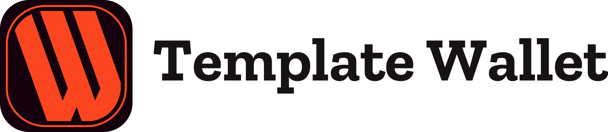

<div align="center">

<picture>
  <source media="(prefers-color-scheme: dark)" srcset="./brand/template-lockup-ondark.png" />
  
</picture>

# WDK Wallet Template — Next.js

**A production-ready, self-custodial multi-chain wallet template for [Next.js](https://nextjs.org), built on [Tether's Wallet Development Kit (WDK)](https://docs.wallet.tether.io).**

Reference implementation for the Tether WDK **Template Wallet** bounty — extending WDK's starter templates beyond React Native to the web's most popular React framework.

[](https://github.com/plinkdev1/wdk-wallet-template/actions/workflows/ci.yml)
[](./LICENSE)
[](https://nextjs.org)
[](#architecture)

</div>

---

## Why this exists

WDK ships a starter template for **React Native** — but the web is where most wallets begin, and Next.js is its most popular React framework. Developers wanting to build a WDK wallet in Next.js have had to wire up the SDK, the secure-execution boundary, the worker bridge, and the wallet UX from scratch.

This template is the missing reference. It is a **real, working, self-custodial wallet**: encrypted seed vault, WDK-backed multi-chain key derivation and signing, live balances, send/receive with QR, and a transaction feed — all in an idiomatic Next.js App Router app. Fork it and you have a wallet in minutes, not weeks.

> **The secure-execution model the bounty asks for.** All seed custody, key derivation, and signing happen inside a dedicated **Web Worker — the "worklet"** — exactly as WDK prescribes. The React app holds only a [Comlink](https://github.com/GoogleChromeLabs/comlink) proxy and **never touches a private key**. The app layer owns UX, history, and monitoring; the worklet owns secrets.

> **Compounding leverage.** The wallet logic lives in two reusable, framework-agnostic packages — `wdk-web-core` (engine) and `wdk-ui` (components) — the *same* packages that power the [WDK Browser Extension](https://github.com/plinkdev1/wdk-wallet-extension). The Next.js app is a thin, idiomatic surface on top. Build the engine once; ship it on every framework.

---

## Features

- 🔐 **Self-custodial vault** — BIP-39 generate / import / validate, encrypted at rest with **AES-256-GCM + PBKDF2-SHA-512 (600k)** in IndexedDB.
- 🧵 **Worklet security** — WDK runs in a Web Worker; the UI talks to it over a typed Comlink bridge and can never read a key.
- ⛓️ **Multi-chain** — EVM (Plasma, Ethereum, Polygon, Arbitrum + testnets), **Solana**, **Bitcoin** (BIP-84), **TON** (v5r1), and **Tron** — each with one-line registry extensibility.
- 👛 **Multi-account** — standard BIP-44 derivation; switch accounts in the UI. _(Multiple **distinct wallets / seed vaults** per user is on the [roadmap](./ROADMAP.md); today it's multiple accounts within one encrypted vault.)_
- 💸 **Send & Receive** — receive with QR + copy; send with **per-family address validation** (EVM/Solana/Bitcoin/TON/Tron), review, and explorer links.
- 📜 **Activity** — live status for transactions you submit, ready to extend with the **WDK Indexer API** for full history.
- 💵 **Fiat values** — native balances shown in **USD** via the WDK CoinGecko pricing client.
- 🎨 **Polished UX** — onboarding, unlock, and dashboard built from the `wdk-ui` component library with a themable design system.
- 🔁 **Lock / reset** — manual lock; reset restores from recovery phrase.

---

## Screenshots

| Onboarding | Recovery phrase | Dashboard |
|:--:|:--:|:--:|
|  |  |  |

| Receive (QR) | Send | Multi-chain |
|:--:|:--:|:--:|
|  |  |  |

**▶ Demo video** — a real screen recording of the running app: set up → create wallet → reveal the 12-word recovery phrase → verify it → dashboard (live on-chain balance) → receive QR.

<video src="https://github.com/plinkdev1/wdk-wallet-template/raw/main/media/demo/wdk-wallet-template-demo.webm" controls muted></video>

> Player not loading (e.g. before the repo is public)? **Download the raw `.webm`:** [`media/demo/wdk-wallet-template-demo.webm`](./media/demo/wdk-wallet-template-demo.webm) (or click **Raw** on the file page). Walkthrough script: [`docs/DEMO.md`](./docs/DEMO.md).

> Screenshots are captured from the running app via headless Chromium against a throwaway test wallet (no real funds).

## Architecture

```
┌──────────────────────────────────────────────────────────────┐
│  Next.js App Router (client)                                  │
│   WalletProvider (React context, state machine)               │
│   onboarding · unlock · dashboard · send · receive · activity │   ← wdk-ui components
│                         │  Comlink proxy (typed RPC)          │
└─────────────────────────┼──────────────────────────────────────┘
                         ▼
┌──────────────────────────────────────────────────────────────┐
│  Web Worker — the "worklet" (the trust boundary)              │
│   WalletWorker (@wdk-starter/wdk-web-core)                    │
│     • WebCrypto vault (PBKDF2 + AES-GCM, IndexedDB)           │
│     • @tetherto/wdk — derivation, signing, tx broadcast       │
│     • chain registry · HTTP RPC adapter · indexer adapter     │
│   seed + private keys live ONLY here                          │
└──────────────────────────────────────────────────────────────┘
```

The full design — framework-selection rationale, the worklet boundary, the Comlink bridge, the state machine, and the integration plan — is in [`docs/ARCHITECTURE.md`](./docs/ARCHITECTURE.md) (this is the bounty's M1 deliverable).

### Repository layout

```
wdk-wallet-template/
├── apps/
│   └── web/                  # The Next.js wallet template
│       └── src/
│           ├── app/          # App Router pages + providers
│           ├── wallet/       # worker.ts (worklet) · wallet-client (Comlink) · provider · chains
│           └── components/   # onboarding · unlock · dashboard · send · receive · activity
├── packages/
│   ├── wdk-web-core/         # Reusable engine (shared with the extension)
│   └── wdk-ui/               # Reusable React component library
├── brand/                    # Brand kit
└── docs/                     # Architecture (M1), setup, integration, demo
```

---

## Quickstart

**Prerequisites:** Node ≥ 20, `pnpm` 10 (`corepack enable`).

```bash
pnpm install
pnpm dev          # builds the shared packages, then starts Next.js at http://localhost:3000
```

Production build:

```bash
pnpm build        # builds packages + the Next.js app
pnpm start
```

Then open <http://localhost:3000>, create a wallet, and you're in. See [`docs/SETUP.md`](./docs/SETUP.md) for RPC configuration and troubleshooting.

---

## Supported chains & assets

| | Status |
|---|---|
| **Plasma, Ethereum, Polygon, Arbitrum** | ✅ derivation, signing, balances, send/receive |
| **Solana** (mainnet / devnet) | ✅ derivation, address, balances, **send** |
| **Bitcoin** (mainnet / testnet) | ✅ BIP-84 address, balance, **send** (Blockbook) |
| **TON** (mainnet) | ✅ v5r1 address, balance, **send** (TonCenter) |
| **Tron** (mainnet) | ✅ address, balance, **send** (TronGrid) |
| **USD fiat values** | ✅ via CoinGecko pricing client |
| **DeFi: Aave lend · Velora swap · USDT0 bridge** | ✅ live in the dashboard DeFi dialog (Comlink) |
| **ERC-4337 gasless · MoonPay on-ramp** | ✅ in the engine; config-driven (see extension for the same UI pattern) |
| **USDt / XAUt tokens** | 🚧 engine ships balances + transfers; UI surfacing next |
| **Lightning (Spark)** | 🚧 roadmap (engine bundler-shim work; see [ROADMAP.md](./ROADMAP.md)) |

The template is transparent about implemented vs. planned scope. Adding a chain is a single entry in `apps/web/src/wallet/chains.ts` plus a loader in `wdk-web-core`.

---

## How it integrates WDK

- **The worklet** (`apps/web/src/wallet/worker.ts`) loads the WDK polyfills, constructs `WalletWorker` with an HTTP RPC adapter, and exposes it via Comlink.
- **The client** (`wallet-client.ts`) spawns the worker once and wraps it with `Comlink.wrap<WalletWorker>`.
- **The provider** (`wallet-provider.tsx`) is a React context + state machine (`loading → no-vault → locked → unlocked`) that calls the worklet for every privileged operation.
- **Next.js config** (`next.config.mjs`) enables the browser polyfills (Buffer/process) and WebAssembly the WDK crypto stack needs, and pins the pure-JS sodium backend for the browser.

Framework-specific notes are in [`docs/INTEGRATION.md`](./docs/INTEGRATION.md).

---

## The shared engine — `@wdk-starter/wdk-web-core`

This wallet is a thin Next.js surface over a reusable, framework-agnostic engine
published to npm as **[`@wdk-starter/wdk-web-core`](https://www.npmjs.com/package/@wdk-starter/wdk-web-core)**
(v0.2.0). The **same engine — byte-identical** — also powers the
[WDK Wallet Extension](https://github.com/plinkdev1/wdk-wallet-extension); build it
once, ship it on every surface.

It wraps Tether's WDK SDK (`@tetherto/wdk-*`) and provides:

- **Encrypted vault** — `WebCryptoVault`, AES-256-GCM + PBKDF2-SHA-512 (600k) in IndexedDB.
- **Multi-chain registry** — EVM · Solana · BTC · TON · Tron · Plasma, one-line extensible.
- **Signing + EIP-3009** gasless transfer builders.
- **Adapters** — HTTP RPC, indexer, relayer, and WebSocket subscriptions.
- **The "worklet"** — a Comlink-exposed Web Worker surface so private keys never leave the worker.

Full API and import paths: [`packages/wdk-web-core/README.md`](./packages/wdk-web-core/README.md).

---

## Quality

- **Strict TypeScript** across the app and both packages.
- **`pnpm typecheck`** and **`pnpm test`** (the shared packages carry 504 passing tests) run in CI on every push, followed by a full `next build`.
- The worklet is runtime-verified: a headless smoke test boots the worker, derives, and generates a mnemonic through the real UI.

---

## Customization — theming & branding

Re-skin and re-brand **without touching component code**. The template consumes
the same `@wdk-starter/wdk-ui` theme + brand system as the extension: three
built-in presets (warm/cool/light), full color/type/radius/motion control via
CSS variables, and `BrandProvider` for the name/wordmark/mark. One edit in
`apps/web/src/app/providers.tsx` re-skins the whole app:

```tsx
<WdkThemeProvider theme={{ ...wdkWarmTheme, colors: { ...wdkWarmTheme.colors, primary: '#0D9488' } }}>
```

Runtime theme/brand pickers (as in the extension) are available from `wdk-ui` to
wire if you want end-user customization. Full guide:
**[`docs/CUSTOMIZATION.md`](./docs/CUSTOMIZATION.md)**.

---

## x402 — agentic / per-request payments

The shared engine can **pay HTTP `402 Payment Required` challenges**: the worklet
signs an EIP-3009 authorization (x402's "exact" scheme) and returns the
`X-PAYMENT` header (`worker.x402_createPayment`, callable over Comlink). The
server-side facilitator (for charging bots/agents) ships in
[wdk-checkout](https://github.com/plinkdev1/wdk-checkout-and-woocommerce-plugin);
the settlement primitive in
[wdk-protocol-eip3009](https://github.com/plinkdev1/wdk-protocol-eip3009).

---

## Documentation

- [`docs/ARCHITECTURE.md`](./docs/ARCHITECTURE.md) — **M1**: framework selection, the worklet model, integration plan.
- [`docs/SETUP.md`](./docs/SETUP.md) — install, run, configure RPC, troubleshoot.
- [`docs/CUSTOMIZATION.md`](./docs/CUSTOMIZATION.md) — theming & branding (swap colors/logo).
- [`docs/INTEGRATION.md`](./docs/INTEGRATION.md) — how WDK is wired into Next.js (worker, polyfills, Comlink).
- [`docs/DEMO.md`](./docs/DEMO.md) — the demo-video walkthrough script.

---

## Roadmap

📍 **Full phased roadmap: [`ROADMAP.md`](./ROADMAP.md).** It shows what ships today
(worklet architecture, EVM + Solana + Bitcoin + TON + Tron, onboarding/send/receive/activity + USD values) and how the
**shared `wdk-web-core` engine** unlocks Bitcoin, tokens, Lightning (Spark),
account abstraction, TON/Tron, in-wallet DeFi, and fiat pricing across this
template and the other WDK surfaces — one engine, many products.

---

## License

[MIT](./LICENSE). Built with [Tether WDK](https://docs.wallet.tether.io). A community reference implementation submitted to the Tether WDK bounty program; not an official Tether product.
